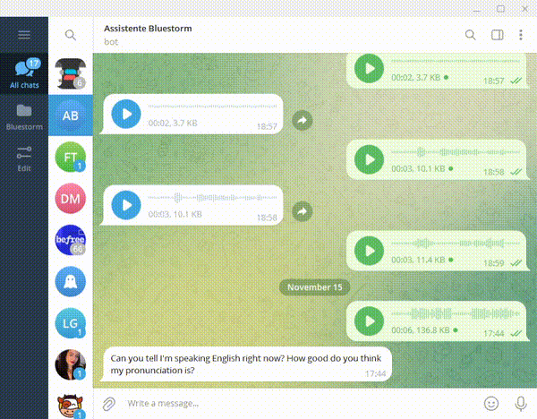

# Telewhisp: Receives audio, transcribes it and sends them back through telegram



## Prepation:

You must have a telegram bot and a valid bot token. You can create one here: [Basic tutorial](https://core.telegram.org/bots/tutorial)

You must have a .env file in the root folder (the folder where main.py is).

Inside the .env file, you must have the following line:  
```
TOKEN=your_telegram_bot_token
```

Run it with **python3 main.py**

## Installing dependencies

You can simply run the following command:

```
pip install -r requirements.txt
```

Or you you prefer to install it manually:

You must install whisper:

```
pip install git+https://github.com/openai/whisper.git
pip install ffmpeg-python
```

And ffmpeg:
```
sudo apt update && sudo apt install ffmpeg
```

If you need additional help for manual installation, please refer to this: [Whisper Github](https://github.com/openai/whisper).
